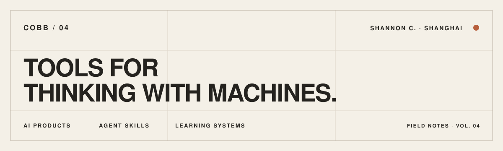

<picture>
  <source media="(prefers-color-scheme: dark)" srcset="./assets/profile-dark.svg">
  <source media="(prefers-color-scheme: light)" srcset="./assets/profile-light.svg">
  
</picture>

  <strong>AI product builder · skill maker · lifelong learner</strong> 
  Turning product judgment into small tools people can actually use.

  <a href="https://cobb04.github.io">website ↗</a>
  &nbsp;·&nbsp;
  <a href="#selected-work">selected work</a>
  &nbsp;·&nbsp;
  <a href="#current-practice">current practice</a>

 

## Hello, I’m ShannonC.

I’m an AI product builder in Shanghai. I like turning fuzzy ideas into small, opinionated tools—some help people work with agents, some make learning stick, and some exist because software can still be playful.

**把模糊的产品感觉，做成可以摸到、运行、反复使用的东西。**

## Selected work

<table>
  <tr>
    <td width="50%" valign="top">
      01 · MACOS / SWIFT
      <h3><a href="https://github.com/Cobb04/Codex-Level">Codex Level ↗</a></h3>
      
Turns lifetime Codex usage into QQ-style levels. Coding agents count tokens; this makes the progress feel alive.

    </td>
    <td width="50%" valign="top">
      02 · AGENT SKILL / LEARNING
      <h3><a href="https://github.com/Cobb04/podcast-to-course">podcast-to-course ↗</a></h3>
      
Turns long conversations into framework cards, decision checklists, interview prompts and a browsable course.

    </td>
  </tr>
  <tr>
    <td width="50%" valign="top">
      03 · AGENT SKILL / MEDIA
      <h3><a href="https://github.com/Cobb04/ai-builders-gazette">AI Builders Gazette ↗</a></h3>
      
A newspaper-style daily for builders who would rather build than keep scrolling through the information flood.

    </td>
    <td width="50%" valign="top">
      04 · AGENT SKILL / LANGUAGE
      <h3><a href="https://github.com/Cobb04/kaoyan-vocab-overlay">kaoyan-vocab-overlay ↗</a></h3>
      
Quietly plants exam vocabulary inside everyday Chinese conversations—learning without opening another tab.

    </td>
  </tr>
</table>

## Current practice

`01` **Products with a point of view** — not feature piles, but small systems with a reason to exist. 
`02` **Skills that bottle judgment** — turning a good process into something an agent can repeat. 
`03` **Learning that leaves an artifact** — notes are better when they become tools, prompts or tiny courses.

 

  率道而行 · SHANGHAI, CN 
  <strong>Make the idea tangible.</strong>

